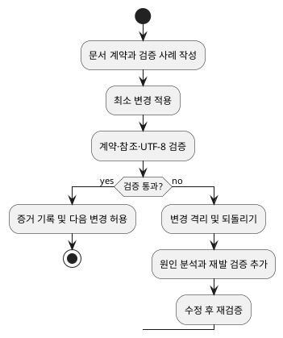

# MD File TDD Rule

# Must

## Scope
- Markdown, plain-text, YAML, JSON 및 코드가 아닌 설정 문서의 생성·수정·삭제 계획에 적용해야 합니다.
- 문서의 의미, 사실 근거, 구조, 링크, 렌더링 및 UTF-8 보존을 테스트 가능한 계약으로 취급해야 합니다.

## Out of Scope
- 실행 코드의 기능·성능 테스트 설계는 `source-code-tdd-rule`에 위임해야 합니다.
- 공통 UTF-8 쓰기 경로와 손상 복구 판단은 `markdown-safe-writing`에 위임해야 합니다.

## Source of Truth
- 이 문서는 문서 변경의 TDD 게이트, 문서 회귀 격리, 운영 지표 및 성장 기준을 관리하며, 실행 코드의 테스트 전략과 안전한 쓰기 경로는 관리하지 않습니다.
- `vocabulary-rule`은 규칙 강도와 용어 정규화의 기준이므로 새 용어 또는 강도 충돌을 판단할 때 참조해야 합니다.
- `markdown-safe-writing`은 안전한 쓰기 방법과 인코딩 사고 복구의 기준이므로 파일 저장·손상 판단을 결정할 때 참조해야 합니다.
- `claude-cross-review-protocol`은 사용자가 Claude 검토를 요청한 경우의 호출과 기록 형식 기준이므로 문서 규칙을 재정의하지 않습니다.

## Design and Test Cases
1. 변경 전 문서 계약을 작성해야 합니다: 대상 독자, 허용된 사실 출처, 필수 섹션·링크·용어, 금지된 주장, 호환성 제약을 식별합니다.
2. 계약마다 관찰 가능한 검증 사례를 먼저 작성해야 합니다: 성공 기준, 실패 또는 중지 조건, 검증 방법, 예상 증거를 한 항목으로 연결합니다.
3. 각 검증 사례는 통과 조건, 실패 조건, 증거 유형을 분리해야 합니다.
4. 생성·수정·의미 보존 재구성 중 변경 유형을 기록하고, 재구성에는 기존 계약 보존 검증을 사용해야 합니다.
3. 사실 주장에는 출처 위치 또는 검증 불가 표시를 연결해야 합니다.
4. 링크·앵커·상대 경로 변경에는 변경 전후의 해석 대상과 끊어진 참조 검사를 포함해야 합니다.
5. 구조 변경에는 제목 계층, 필수 섹션, 코드 블록 경계 및 문서 간 용어 일치 검사를 포함해야 합니다.
6. 한국어를 포함하는 문서에는 UTF-8 디코딩, 비정상적인 `?` 반복 및 대표 한국어 문장 보존 검사를 포함해야 합니다.

## Execution and Regression Control
1. 테스트 사례와 승인 기준이 준비되기 전에는 문서를 수정해서는 안 됩니다.
2. 최소 변경으로 실패 사례를 통과시킨 후 전체 문서 계약과 영향을 받는 참조를 다시 검증해야 합니다.
3. 검증 실패 시 병합·배포·후속 확장을 중지하고, 실패를 재현 가능한 문서 입력과 검증 로그로 격리해야 합니다.
4. 원인이 확인된 회귀에는 재발을 검출하는 검증 사례를 추가한 후에만 수정본을 재검증해야 합니다.
5. 문서 계약을 깨는 변경은 호환성 안내와 되돌리기 방법이 없으면 적용해서는 안 됩니다.

## Operations and Growth
- 각 변경에는 변경 식별자, 계약 항목, 검증 결과, 실패 원인, 되돌리기 가능 여부를 기록해야 합니다.
- 운영 중 링크 오류, 렌더링 오류, 인코딩 오류, 근거 없는 주장, 계약 위반을 별도 건수로 관찰해야 합니다.
- 동일 원인의 회귀가 두 번 발생하면 해당 원인에 대한 자동 또는 정적 검증을 추가하는 개선 항목을 생성해야 합니다.
- 다중 문서 소비자, 즉시 되돌릴 수 없는 변경, 규칙 계약 변경에는 호환성·되돌리기·독립 검토 중 위험을 검출하는 최소 검증을 추가해야 합니다.
- 문서 집합 확장은 공통 템플릿을 복제하는 대신 계약 템플릿과 검증 항목을 재사용해야 합니다.
- 분기별 검토에서 사용되지 않는 규칙, 검증 불가능한 규칙, 중복 계약을 식별하고 폐기·통합·보류 결정을 증거와 함께 기록해야 합니다.

# Must NOT

## Unsafe Changes
- 검증되지 않은 사실을 사실로 작성해서는 안 됩니다.
- 렌더링 확인만으로 링크, 구조 또는 텍스트 보존 검증을 완료해서는 안 됩니다.
- 실패한 검증을 경고 없이 통과로 바꾸거나 기준선을 갱신해서는 안 됩니다.
- 회귀 원인을 확인하지 않은 상태에서 동일 범위의 재시도를 반복해서는 안 됩니다.
- 문서 계약과 무관한 대규모 재서식을 기능 변경과 같은 변경 세트에 포함해서는 안 됩니다.

# Flow

1. 변경 범위와 문서 계약을 정규화합니다.
2. 계약별 검증 사례와 중지 조건을 설계합니다.
3. 최소 변경을 적용합니다.
4. 계약 검증과 참조·인코딩 검증을 실행합니다.
5. 실패하면 격리·되돌리기·재발 테스트를 수행하고, 성공하면 증거를 보고합니다.

# Definition of Done

## Verification
- 변경 전 계약과 계약별 검증 사례가 존재합니다.
- 사실 출처 또는 검증 불가 표시, 구조, 링크, 렌더링 및 UTF-8 보존 결과가 증거로 확인됩니다.
- 실패한 사례는 격리·되돌리기 또는 재발 검증으로 처리되었고, 통과로 위장되지 않았습니다.
- 변경 범위 밖의 문서가 수정되지 않았습니다.

## Monitoring
- 운영 기록에서 계약 위반 유형별 건수와 재발 여부를 확인할 수 있습니다.
- 분기별 검토 결과에서 성장·폐기·통합 결정과 근거를 확인할 수 있습니다.
