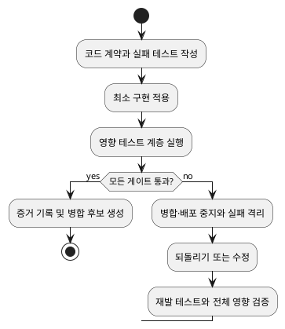

# Source Code TDD Rule

# Must

## Scope
- 애플리케이션, 라이브러리, 스크립트 및 실행 가능한 구성의 생성·수정·삭제에 적용해야 합니다.
- 기능, 오류 처리, 호환성, 관측성 및 성능 예산을 검증 가능한 코드 계약으로 취급해야 합니다.

## Out of Scope
- Markdown과 일반 텍스트의 의미·링크·인코딩 계약은 `md-file-tdd-rule`에 위임해야 합니다.
- 빌드 도구의 구체 명령과 프레임워크별 테스트 문법은 대상 프로젝트의 공식 문서와 기존 테스트 설정에 위임해야 합니다.

## Source of Truth
- 이 문서는 코드 변경의 TDD 게이트, 회귀 격리, 운영 신호 및 품질 제어 성장 기준을 관리하며, 문서 콘텐츠 계약과 도구별 테스트 문법은 관리하지 않습니다.
- `vocabulary-rule`은 규칙 강도와 용어 정규화의 기준이므로 새 상태·위험 용어를 판단할 때 참조해야 합니다.
- `claude-cross-review-protocol`은 사용자가 Claude 검토를 요청한 경우의 호출과 기록 형식 기준이므로 테스트 전략을 재정의하지 않습니다.

## Design and Test Cases
1. 구현 전에 변경 계약을 작성해야 합니다: 입력, 출력, 오류, 상태 전이, 호환성, 보안 경계, 성능 또는 자원 예산을 식별합니다.
2. 계약마다 먼저 실패하는 테스트를 작성해야 합니다: 정상 경로, 경계값, 오류 경로, 이전 동작 보존을 구분합니다.
3. 각 테스트는 통과 조건, 실패 조건, 증거 유형을 분리해야 합니다.
4. 생성·수정·의미 보존 재구성 중 변경 유형을 기록하고, 재구성에는 기존 외부 동작 고정 테스트를 사용해야 합니다.
3. 외부 시간, 난수, 네트워크, 파일 시스템은 제어 가능한 대역으로 분리하여 테스트를 결정적으로 만들어야 합니다.
4. 모듈 경계를 넘는 변경에는 소비자 관점의 계약 테스트 또는 동등한 통합 검증을 포함해야 합니다.
5. 단위 테스트로 계약을 관찰할 수 있으면 같은 oracle의 통합 테스트를 추가하지 말고, 경계에서만 관찰 가능하면 통합 테스트를, 복수 경계 수용 기준에는 E2E 테스트를 사용해야 합니다.
5. 결함 수정에는 결함을 재현하는 회귀 테스트를 먼저 추가해야 합니다.
6. 성능 또는 자원 영향이 있는 변경에는 기준선, 허용 예산, 측정 방법, 편차 발생 시 중지 기준을 정의해야 합니다.

## Execution and Regression Control
1. 실패 테스트와 승인 기준이 준비되기 전에는 구현을 시작해서는 안 됩니다.
2. 한 변경은 한 계약 또는 명시된 계약 묶음으로 제한하고, 비기능적 재서식은 기능 변경과 분리해야 합니다.
3. 최소 구현으로 테스트를 통과시킨 후 단위·통합·계약·정적 검증 중 영향 범위에 해당하는 계층을 실행해야 합니다.
4. 실패한 테스트, 불안정한 테스트 또는 예산 초과가 있으면 병합·배포·후속 확장을 중지하고 재현 입력·환경·로그를 보존해야 합니다.
5. 원인이 확인된 회귀에는 재발 테스트와 영향을 받은 계약 계층의 재실행을 완료한 후에만 수정본을 허용해야 합니다.
6. 공개 인터페이스를 변경할 때는 호환성 테스트, 마이그레이션 또는 명시적 폐기 계획 중 하나를 제공해야 합니다.

## Operations and Growth
- 각 변경에는 변경 식별자, 계약, 테스트 계층, 실행 결과, 알려진 위험, 되돌리기 절차를 기록해야 합니다.
- 운영에서는 실패율, 재시도율, 지연 시간, 자원 사용량, 오류 분류, 테스트 불안정 건수를 계약별로 관찰해야 합니다.
- 같은 회귀 원인이 두 번 발생하면 해당 경계에 회귀 테스트와 예방 제어를 추가해야 합니다.
- 다중 소비자, 즉시 되돌릴 수 없는 변경, 규칙 계약 변경에는 호환성·되돌리기·독립 검토 중 위험을 검출하는 최소 검증을 추가해야 합니다.
- 프로젝트 확장은 단위 테스트만 늘리지 말고, 새 의존성·인터페이스·운영 실패 모드에 대응하는 테스트 계층을 추가해야 합니다.
- 월별 품질 검토에서 느린 테스트, 불안정한 테스트, 중복 테스트, 미측정 고위험 계약을 분류하고 제거·격리·강화·보류 결정을 증거와 함께 기록해야 합니다.
- 테스트 실행 시간이 정의된 예산을 넘으면 병렬화, 격리, 계층 분리 중 하나의 개선 계획을 승인 기준과 함께 수립해야 합니다.

# Must NOT

## Unsafe Changes
- 통과시키기 위해 검증 대상 동작을 삭제하거나 약화해서는 안 됩니다.
- 실제 오류를 숨기는 광범위한 mock, 임의 재시도 또는 예외 무시를 테스트 통과 수단으로 사용해서는 안 됩니다.
- 실패하거나 불안정한 테스트를 근거 없이 삭제·건너뛰기·기준선 갱신해서는 안 됩니다.
- 재현 가능한 회귀를 테스트 없이 종결해서는 안 됩니다.
- 성능 또는 호환성 영향을 측정하지 않은 채 기존 계약을 변경해서는 안 됩니다.

# Flow

1. 코드 계약과 위험 범위를 정규화합니다.
2. 실패 테스트와 수용 기준을 설계합니다.
3. 최소 구현을 적용합니다.
4. 영향 테스트 계층과 정적·예산 검증을 실행합니다.
5. 실패하면 격리·되돌리기·재발 테스트를 수행하고, 성공하면 운영 증거를 기록합니다.

# Definition of Done

## Verification
- 구현 전에 계약, 실패 테스트, 승인 기준 및 중지 기준이 존재합니다.
- 정상·경계·오류·회귀 경로와 필요한 통합 또는 계약 검증 결과가 확인됩니다.
- 외부 의존성 테스트의 결정성, 성능 예산 또는 비적용 근거가 확인됩니다.
- 실패는 재현 로그와 재발 테스트로 처리되었고, 근거 없이 삭제·건너뛰기·기준선 갱신되지 않았습니다.

## Monitoring
- 운영 기록에서 계약별 오류·지연·자원·재시도와 테스트 불안정 건수를 확인할 수 있습니다.
- 월별 검토 결과에서 테스트 계층 확장 또는 제거 결정과 근거를 확인할 수 있습니다.
